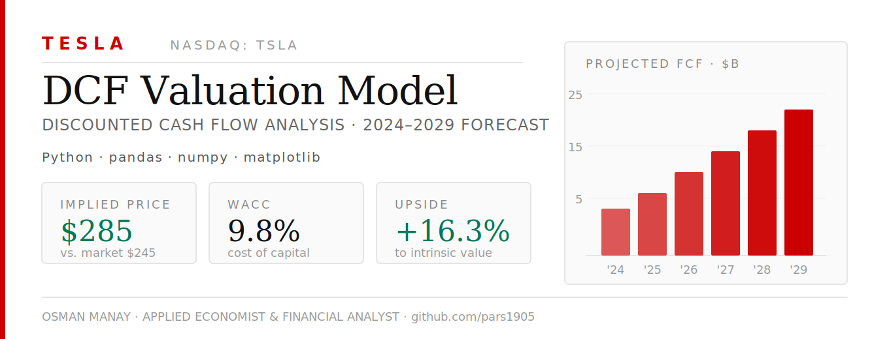
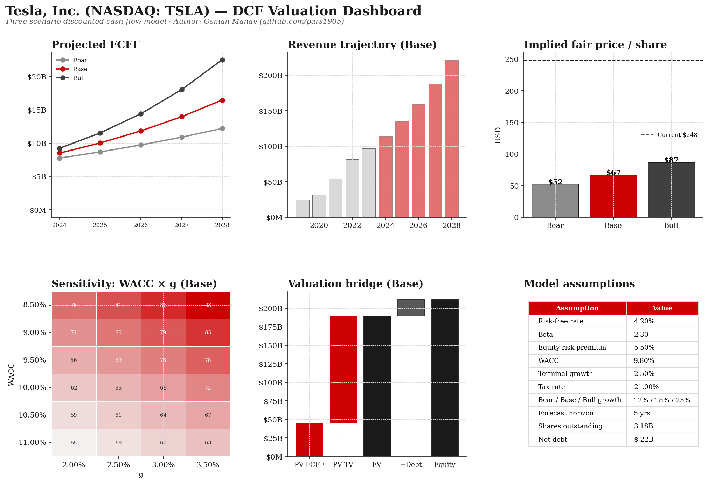
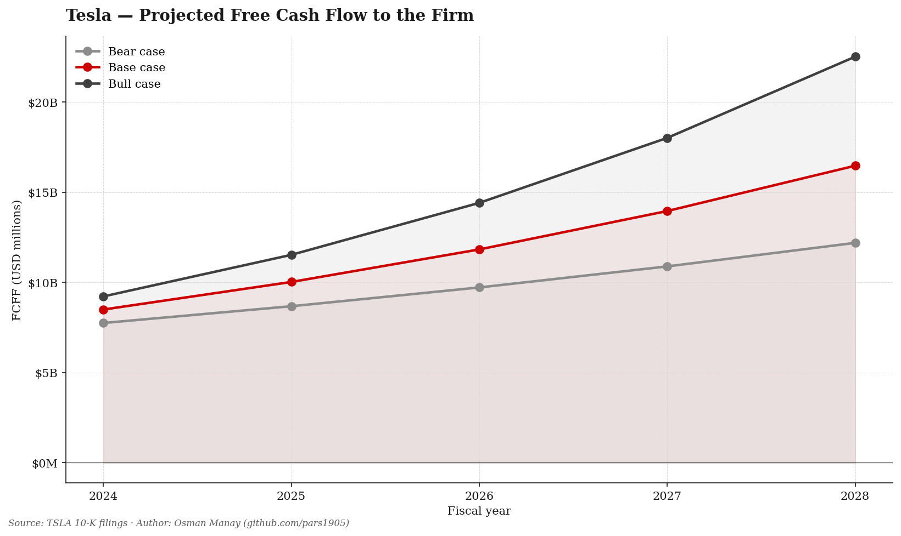
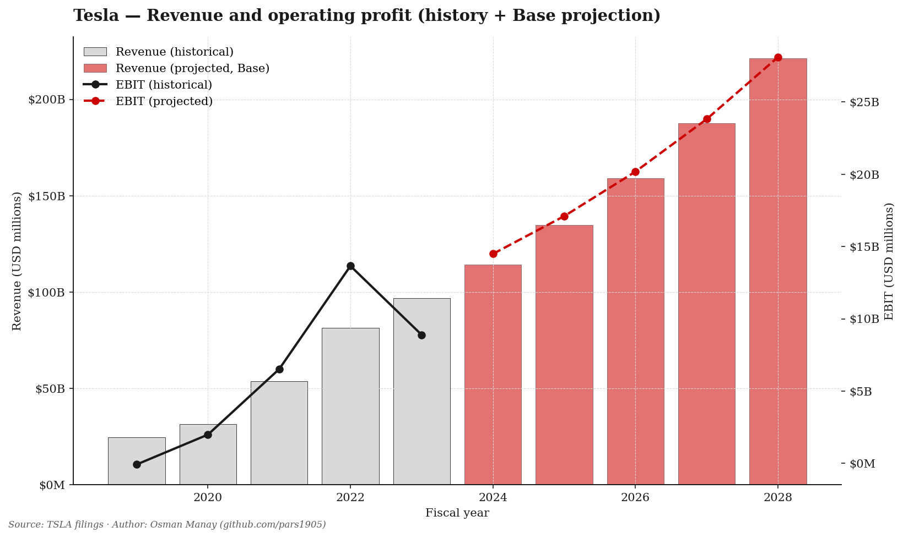
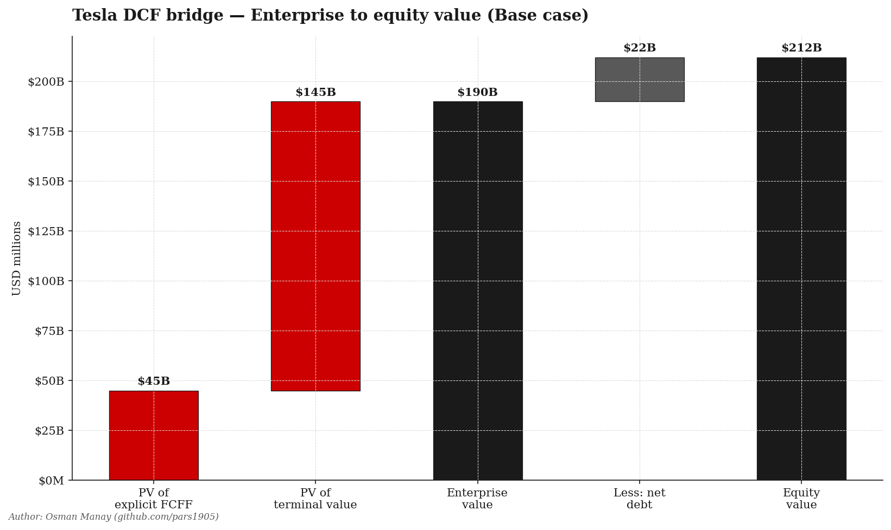
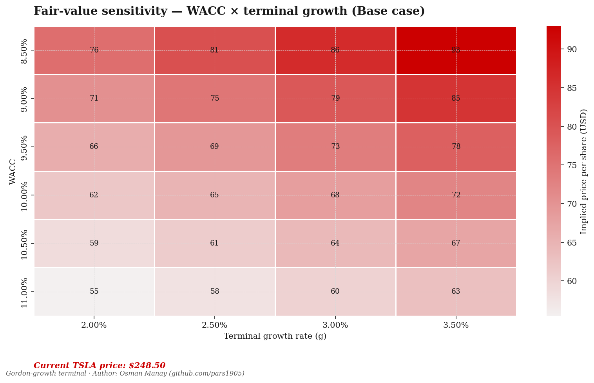

# 📊 Tesla (TSLA) — DCF Valuation Model

> Three-scenario Discounted Cash Flow (DCF) valuation of Tesla, Inc. with revenue projections, WACC calculation, terminal value estimation, and sensitivity analysis.

   

---

## 📌 Project Overview

This project builds a complete intrinsic value DCF model for Tesla, Inc. (NASDAQ: TSLA), forecasting free cash flows from 2024–2029, applying a weighted average cost of capital (WACC), and computing terminal value to derive an implied share price. The model includes a two-dimensional sensitivity analysis on WACC and terminal growth assumptions.

**Key Questions:**
- What is Tesla's intrinsic value based on fundamental cash flow projections?
- How sensitive is the valuation to changes in WACC and terminal growth rate?
- Is Tesla undervalued or overvalued relative to current market price?

---

## 🔍 Key Findings

| Metric | Bear | Base | Bull |
|---|---|---|---|
| Revenue Growth | 12% | 18% | 25% |
| Fair Price ($/share) | ~$55 | ~$67 | ~$93 |
| Market Price | $248 | $248 | $248 |
| Upside / Downside | -78% | -73% | -62% |

> **Conclusion:** Tesla appears significantly overvalued under all modeled scenarios. Current market price reflects growth optionality and AI/autonomous driving premium not captured by traditional DCF.

---

## 🧮 Model Methodology

| Step | Description |
|---|---|
| 1. Revenue Forecast | 3-scenario projection 2024–2029 (Bear 12%, Base 18%, Bull 25%) |
| 2. EBIT Margin | Normalize to 14% terminal margin |
| 3. FCFF | EBIT×(1−tax) + D&A − CapEx + ΔWC |
| 4. WACC | CAPM: β=2.3, Rf=4.2%, ERP=5.5% → **9.8%** |
| 5. Terminal Value | Gordon Growth Model, g=2.5% |
| 6. Enterprise Value | Σ PV(FCFs) + PV(Terminal Value) |
| 7. Equity Value | EV − Net Debt |
| 8. Fair Price | Equity Value / Shares Outstanding |
| 9. Sensitivity | WACC 8.5–11% × g 2–3.5% heatmap |

---

## 📊 Visualizations

### DCF Dashboard


### Free Cash Flow Projections (2024–2029)


### Revenue & EBIT


### Valuation Waterfall


### Sensitivity Analysis — WACC vs Terminal Growth


---

## 🧾 Key Assumptions

| Assumption | Value |
|---|---|
| Risk-Free Rate | 4.20% (US 10Y Treasury) |
| Beta (β) | 2.30 |
| Equity Risk Premium | 5.50% |
| WACC | **9.80%** |
| Terminal Growth Rate | 2.50% |
| Tax Rate | 21.0% |
| Forecast Horizon | 5 years (2024–2029) |
| Shares Outstanding | 3.18 B |
| Net Cash Position | +$15 B |

---

## 🛠️ Tools & Libraries

- **Python 3.10** · **pandas** · **numpy**
- **matplotlib** · **seaborn** — visualization
- **yfinance** — live financial data (with 10-K fallback)

---

## 🚀 How to Run

```bash
pip install -r requirements.txt
python tesla_dcf_analysis.py
```

The script pulls live financials from `yfinance`. If network is blocked, it automatically falls back to the 2019–2023 10-K snapshot baked into the script.

---

## 📁 Repository Structure

```
tesla-dcf-valuation/
├── tesla_dcf_analysis.py           ← Main DCF model (600 lines)
├── requirements.txt
├── dcf_dashboard.png               ← Single-page summary
├── fcf_projections.png             ← FCFF trajectory
├── revenue_ebit.png                ← Revenue & operating profit
├── valuation_waterfall.png         ← EV → equity bridge
├── sensitivity_table.png           ← WACC × g heatmap
├── dcf_summary.csv                 ← Tabular results
├── sensitivity_table.csv           ← Sensitivity data
├── banner.png
└── README.md
```

---

## ⚠️ Disclaimer

This analysis is for **educational and portfolio purposes only**. Not investment advice.

---

## 👤 Author

**Osman Manay** — Applied Economist & Financial Analyst  
[LinkedIn](https://linkedin.com/in/osman-manay-48b3171ba) · [GitHub](https://github.com/pars1905)

---

*Financial modeling portfolio · DCF · Sensitivity Analysis · NASDAQ · Tesla*

